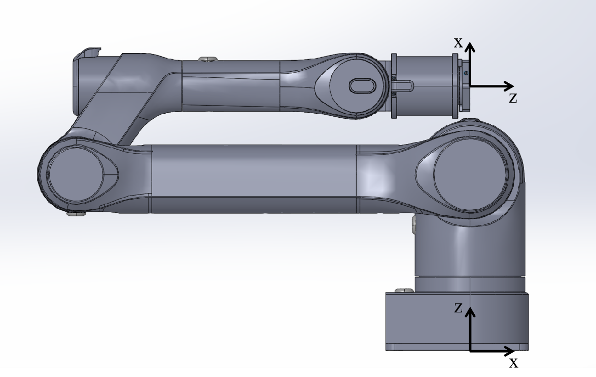
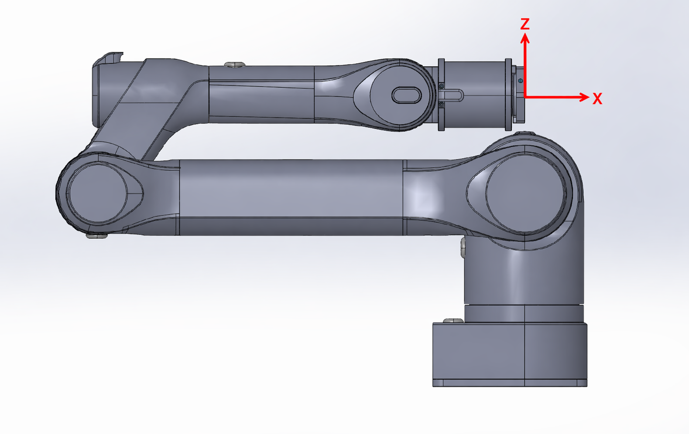

# carm_control

## 安装

```bash
conda create -n carm_control python=3.10
conda activate carm_control
pip install -e .
```

## 为什么要加 TCP

机械臂底层的 `move_pose()` 控制的是法兰盘坐标系，也就是 flange frame：



实际使用工具时，我们更关心工具末端的位姿，也就是 TCP frame：



如果直接控制 flange，换工具或工具有长度偏移时，目标点会偏到法兰盘上。`TcpCarm` 在 `Carm` 外面加了一层 TCP offset，把用户给的 TCP 目标位姿转换成底层需要的 flange 位姿。


## TCP 接口

所有 TCP 姿态都使用 6 维：

```python
[x, y, z, roll, pitch, yaw]
```

其中 `roll/pitch/yaw` 单位是弧度，数组按 RPY 存储，旋转顺序是 ZYX。

```python
from controller.tcp_carm import DEFAULT_TCP_OFFSET, TcpCarm

robot = TcpCarm()
robot.set_ready()
robot.set_tcp_offset(DEFAULT_TCP_OFFSET)
robot.move_tcp_pose([0.32, 0.01, 0.35, 0.0, 1.57, 0.0])
robot.disconnect()
```

接口说明：

- `set_tcp_offset([x, y, z, roll, pitch, yaw])`：设置 TCP 到 flange 的固定偏移。
- `move_tcp_pose(tcp_pose, is_sync=True)`：点到点移动 TCP 到目标位姿。
- `track_tcp_pose(tcp_pose)`：周期跟踪 TCP 目标位姿，适合键盘控制这类连续控制。
- `get_tcp_pose()`：读取当前实际 TCP 位姿，返回 `[x, y, z, roll, pitch, yaw]`。

## 关节空间接口

关节空间接口直接沿用 `Carm`，目标是 6 维关节角：

```python
robot.move_joint([j1, j2, j3, j4, j5, j6], is_sync=True)
```

- `move_joint(joints, is_sync=True)`：点到点移动到目标关节位置。
- `robot.joint_pos`：读取当前实际关节位置。
